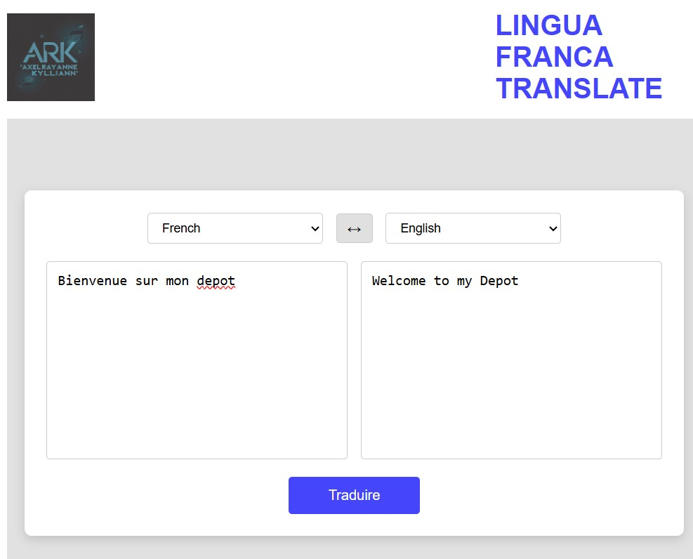

# 🌍 Lingua Franca Translate

**Lingua Franca** is a fast and intuitive multilingual translation web application built with **Flask**, **JavaScript**, and an unofficial, free **Google Translate API**.

---

## 🔧 Overview

This project was developed as part of my academic training and aims to demonstrate how to build a web application that integrates a third-party API using **Flask** as a backend framework.

The app enables users to:
- Translate text between multiple languages
- Swap source and target languages with one click
- Hear the translated text via browser-based text-to-speech
- Enjoy a clean, responsive, and interactive interface thanks to **HTML**, **CSS**, and **JavaScript**

---

## 🔁 How It Works

1. The user enters text and selects the source and target languages.
2. The text is sent from the frontend to the Flask backend.
3. Flask communicates with the **Google Translate API**, passing the input text and language parameters.
4. The API returns the translated text.
5. Flask processes and returns the translation to the frontend.
6. Optionally, the user can click the "speak" button to hear the translated text aloud.

---

## 🧠 Technologies Used

- **Python**
- **Flask**: A lightweight Python web framework used to handle routing and server-side logic.
- **Google Translate API**: A free and unofficial translation API used by Chrome. It enables programmatic access to Google’s translation service.
- **HTML / CSS / JavaScript**: For building a responsive, user-friendly interface and adding interactive features.

> ⚠️ **Note:** This is an unofficial API and may stop working if Google decides to restrict it.

---

## 📸 Preview



---

## 📂 Project Structure

lingua-franca/</br>
├── app.py</br>
├── requirements.txt</br>
├── .gitignore</br>
├── static/</br>
│ ├── style.css</br>
│ ├── script.js</br>
│ └── logo.jpg</br>
├── templates/</br>
│ └── index.html

---

## ⚙️ Local Installation

1. **Clone the repository**
```bash
git clone https://github.com/yourusername/lingua-franca.git
cd lingua-franca

python -m venv venv

### Windows
.\venv\Scripts\activate
### macOS / Linux
source venv/bin/activate

pip install -r requirements.txt

python app.py